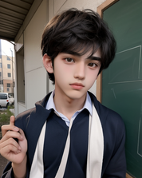

# Neural_style_tranfer_original
The code aims to achieve a proficiency at a begineer level and provide an interface which can do things like style transfer in the way you imagine, the thing is that it is not onlystyle tranfer but also making stylised image better using the python libraries.

ORIGINAL IMAGES

 .png)

STYLISED IMAGES 

.jpg) .jpg)

STYLES 

 

These are the samples that we have created from the existing neural style transfer model and this is just the beginning of achieving the state of the art performance from the existing model.

# Model Structure
The model is implemented by extracting the feature maps for the style and content image from the pretrained model (here we have used the VGG19) and then we will compare it to the image that we get when we input a random noise into the pre trained model. The content feature map is extracted from only one of the bottom most layer where the layers learn how to recognise the high level features and the style features are extracted from beginning layer of the convolutional block, the main thing is how to get the things compared and for that we have the basic gram matrix concept which integrates the different features that we get from the feature map for the style image and then we use some manipulation to get into the final version. 

The images are converted to tensor for better computation and in the future models we are going to integrate the vision transform for the attention mechanism in the style as well as the content image and get a better visual representation of the stylised image. 

# Optimization and losses
We have used the Adam optimizer and have choosen a high value for the learning rate for more change in the content image, the training is done on the basis of the losses calucated for the difference in the style and content feature maps from there respective generated style and content feature map from the noise, we can choose the weights for the style and content loss here too for the optimization of the final stylised image.

The weights for the style and content image control the importance that we want to give to the respective images and this requires a greater optimization and hit and trail for getting it to the art level.

# Training
There are less steps which we have incorporated in the code because we have kept the learning rate a little high, during the training you can see the changes that are being made to the image and you get the final image stored and saved for you.

Created with Love,

Vishesh Bhardwaj

 
