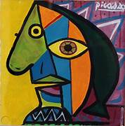
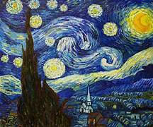

# Neural_style_tranfer_original
The code aims to achieve a proficiency at a begineer level and provide an interface which can do things like style transfer in the way you imagine, the thing is that it is not onlystyle tranfer but also making stylised image better using the python libraries.

STYLISED IMAGES 
.jpg) .jpg)

STYLES 
 

These are the samples that we have created from the existing neural style transfer model and this is just the beginning of achieving the state of the art performance from the existing model.
